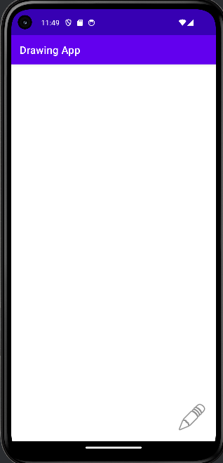
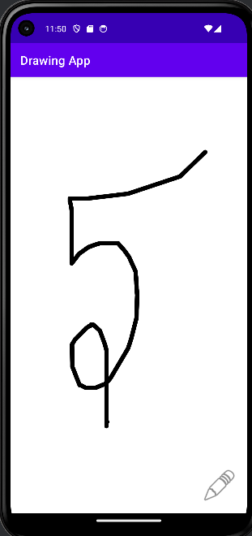
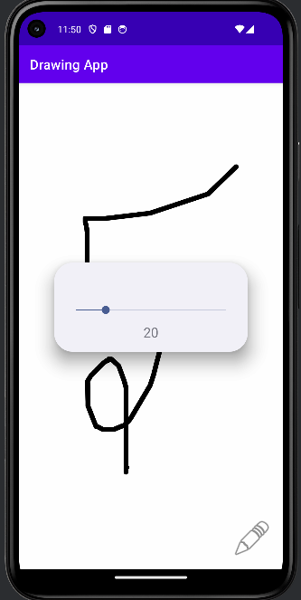
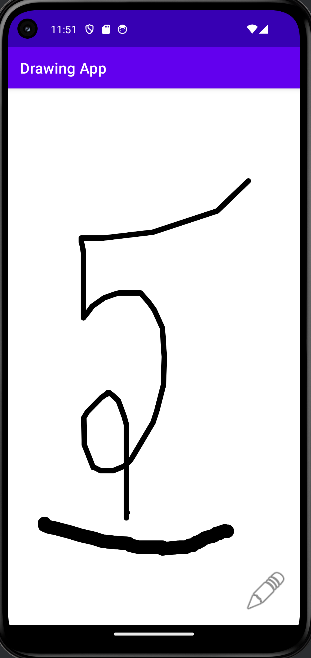

# 🎨 Drawing App

A simple and lightweight Android Drawing Application built using **Kotlin** and **Android Studio**. The app allows users to draw freely on a canvas and dynamically adjust the brush size through an intuitive slider dialog.

---

## 📱 Preview

| Home Screen | Drawing | Brush Size Dialog | Thick Brush |
|------------|----------|-------------------|-------------|
|  |  |  |  |

> Create a `screenshots` folder in your repository and add the images there.

---

## ✨ Features

- 🖌️ Freehand drawing on canvas
- 📏 Adjustable brush size
- 🎨 Smooth drawing using Canvas API
- ⚡ Lightweight and responsive
- 📱 Simple and clean Material Design interface
- 👨‍💻 Beginner-friendly Android project

---

## 🛠️ Built With

- **Kotlin**
- **Android Studio**
- **Canvas API**
- **Paint Class**
- **Custom View**
- **Material Components**

---

## 📂 Project Structure

```
DrawingApp
│
├── app
│   ├── src
│   │   ├── main
│   │   │   ├── java
│   │   │   │   ├── MainActivity.kt
│   │   │   │   └── DrawingView.kt
│   │   │   ├── res
│   │   │   │   ├── layout
│   │   │   │   ├── drawable
│   │   │   │   └── values
│   │   │   └── AndroidManifest.xml
│
└── build.gradle.kts
```

---

## 🚀 Getting Started

### Clone the repository

```bash
git clone https://github.com/Diptanil-Sen/DrawingApp.git
```

### Open in Android Studio

1. Open Android Studio
2. Select **Open Existing Project**
3. Choose the cloned project folder
4. Sync Gradle
5. Run the application on an emulator or Android device

---

## 🎯 Learning Objectives

This project demonstrates:

- Creating a Custom View
- Drawing with Canvas and Paint
- Handling Touch Events
- Building Custom Dialogs
- Using SeekBar for dynamic input
- Android UI development using Kotlin

---

## 🔮 Future Enhancements

- 🎨 Color Picker
- 🩹 Eraser Tool
- ↩️ Undo / Redo
- 💾 Save Drawing to Gallery
- 📤 Share Drawing
- 🗑️ Clear Canvas
- 🖼️ Import Background Image

---

## 🤝 Contributing

Contributions are welcome! Feel free to fork this repository, improve the project, and submit a pull request.

---

## ⭐ Support

If you found this project useful, please consider giving it a **Star ⭐** on GitHub.

---

## 👨‍💻 Author

**Diptanil Sen**

Android Developer • Kotlin Enthusiast • Open Source Learner

GitHub: https://github.com/Diptanil-Sen
---

> *"Learning Android development is best achieved by building projects. This Drawing App is a step toward mastering Custom Views and Canvas APIs."*
